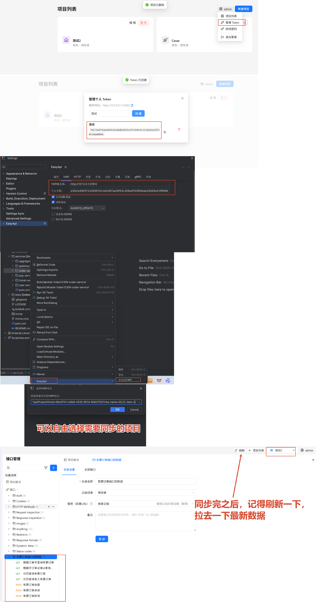

# ApiMocktle

一个 IntelliJ IDEA 插件，从源码提取 API 并同步到 [ApiMocktle](https://github.com/xiaohuiduan/ApiMocktle)。

## 更新日志

### v2.2.0 — 修复 YAPI 导出 Map 类型响应体丢失

- **修复**：`Result<Map<String, Xxx>>` 等包含 Map 泛型的返回类型，导出到 YAPI 后 Map 字段值结构显示为 `{}` 的问题
- **改进**：`JsonSchemaBuilder` 的 Map 类型改用 `properties` + 示例 key 生成 JSON Schema，兼容 YAPI 的 mock 预览渲染

### v2.1.0 — 统一名字 & EasyApi → ApiMocktle

- **名字统一**：清理所有 EasyApi 名字，避免与[EasyApi](https://github.com/tangcent/easy-yapi)插件冲突，设置页、右键菜单统一显示为 ApiMocktle
- **菜单重构**：右键菜单扁平化，去掉多余的"导出"按钮，只保留「调用」和「导出到ApiMocktle」
- **快捷键**：「导出到ApiMocktle」继承 `Alt+Shift+E` 快捷键
- **通知/控制台**：所有通知组、控制台窗口标题改为 ApiMocktle
- **内部清理**：重命名所有 EasyApi* 类、State 持久化名称、缓存目录等

### v2.0.0 — 个人令牌 + 项目选择同步

- 新增 YAPI 设置页检测令牌按钮
- 支持个人令牌认证和项目选择同步

## 同步设置以及案例

该插件必须结合[ApiMocktle](https://github.com/xiaohuiduan/ApiMocktle)进行共同使用。



## 功能

### API 导出到 ApiMocktle

- 从 Java / Kotlin / Scala / Groovy 源码解析 API 端点
- 使用**个人令牌**认证，无需为每个模块单独配置
- 导出时下拉选择目标项目，支持搜索过滤
- 自动创建分类、检测重复接口、更新确认

### API 仪表盘

内置工具窗口，浏览、搜索、调用 API：

- 按模块和类浏览接口树
- 搜索接口路径、名称、方法
- 查看参数、请求头、请求体详情
- 直接从仪表盘发送 HTTP 请求
- 单击导航至源码

### 发送 API 请求

- 右键控制器方法 → **调用**（`Alt+Shift+C`）
- 编辑参数后发送，查看带语法高亮的响应

### API 全局搜索

双击 Shift → APIs 标签 → 按方法前缀（`GET /users`）或关键字搜索。

### 字段转换

- 类字段 → JSON / JSON5 / Properties

## 支持的框架

| 类别 | 支持 |
|------|------|
| 语言 | Java、Kotlin、Scala、Groovy |
| Web 框架 | Spring MVC、Spring Cloud OpenFeign、JAX-RS |
| RPC | gRPC |
| 校验 | javax.validation / Jakarta Validation |
| 序列化 | Jackson、Gson |
| API 注解 | Swagger 2 / OpenAPI 3 |

## 安装

1. 从 `build/distributions/` 获取 `ApiMocktle-x.x.x.zip`
2. IDEA → Settings → Plugins → 齿轮 → Install Plugin from Disk
3. 选择 zip 文件，重启 IDEA

**兼容性**：IntelliJ IDEA 2023.3+ / JDK 17+

## 使用方法

### 导出到 ApiMocktle

1. **配置个人令牌**：Settings → ApiMocktle → 导出到 ApiMocktle → 输入服务器地址和个人令牌
2. 右键控制器文件 / 类 / 方法 → **导出到ApiMocktle**（`Alt+Shift+E`）
3. 在弹出的项目选择框中选择目标项目
4. API 自动同步

### 调用 API

右键控制器方法 → **调用**（`Alt+Shift+C`），编辑参数后发送。

### 打开仪表盘

Tools → 打开API仪表盘，或点击底部 **API Dashboard** 标签。

## 配置

插件使用分层配置系统：

| 优先级 | 来源 | 说明 |
|--------|------|------|
| 最高 | 本地文件 | 项目根目录 `.easy.api.config` |
| | 扩展 | 内置扩展配置 |
| | 远程 | 从 URL 加载的配置 |
| 最低 | 内置 | 默认配置 |

支持 Groovy 脚本、正则表达式、注解表达式等规则引擎语法。

## 开发

### 环境要求

- JDK 17+
- IntelliJ IDEA 2023.3+

### 构建

```bash
# 编译
./gradlew clean buildPlugin

# 运行 IDEA 实例
./gradlew runIde

# 运行测试
./gradlew clean test
```

## 架构

```
IDE 层 (Actions, Dashboard, Line Markers, Search)
    ↓
导出层 (ExportOrchestrator → ClassExporter → YapiExporter)
    ↓
核心服务 (RuleEngine, ConfigReader, ApiIndex, HttpClient)
    ↓
PSI 分析 (TypeResolver, DocHelper, AnnotationHelper)
```

- **ClassExporter** — 从 PSI 类提取 `ApiEndpoint` 模型
- **YapiExporter** — 格式化、上传至 YAPI
- **ExportOrchestrator** — 协调扫描到导出的完整流程
- **RuleEngine** — 评估规则表达式，自定义解析行为

## 致谢
1. 本项目是在大佬[tangcent/easy-yapi](https://github.com/tangcent/easy-yapi)的项目基础上进行改造，去除了一些与ApiMocktle不相关的功能，并进行了翻译为中文，同时对令牌相关的逻辑进行了修改，简化了同步的过程逻辑。
2. 感谢mimo 100T计划，给我提供的免费2亿credits套餐（虽然我一天就蹬完了🤣）。
3. 感谢伟大的DeepSeek V4 pro，在五一期间降价，让我疯狂蹬，花费却不到100，完成了项目所有内容。